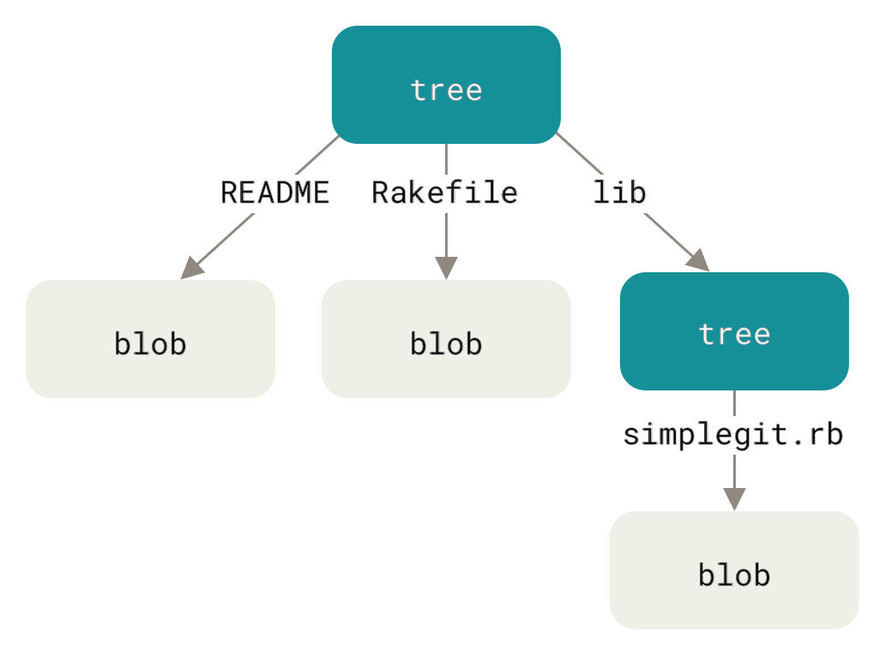

## Building Git: Part IV



Yo what's good, guys? What amazing project you guys are working on?
In the previous part we built the link to the past, aka commit history.
Currently, in our implementation we are just storing only the single
tree (or the root directory) but the git also stores all the sub-directories
in the root directory or the directory in which the `.git` file has been
initialized.

Now, we are going to update our code to store all the sub-directories in the
root tree.

#### Executable files

Currently, we are just storing the file mode as `100644`, which is the default for
all the normal files, but what about the files that are not normal? Like exectuable
complied file created by running `go build`. These files have different file mode
mainly `100755`.

The starting `10` tells us that it is a file, and the remaining part tells us the
permission of the files for the different users. If you want to understand the
file permission you can read my [Understanding Linux filesystem](https://vikuuu.github.io/2024-12-01-understanding-linux-file-system/).

##### Storing Executable files in tree

Now let's get to storing the file modes.

`database.go`

```go

import (
    "syscall"
)


// Updating the Entries struct
type Entries struct {
    Path string
    OID  []byte
    Stat string // New field for storing file mode
}

func CreateTreeEntry(entries []Entries) bytes.Buffer {
    var buf bytes.Buffer
    for _, entry := range entries {
        // Update this line, now storing dynamic filemode
        input := fmt.Sprintf("%s %s", entry.Stat, entry.Path)
        buf.WriteString(input)
        buf.WriteByte(0)
        buf.Write(entry.OID)
    }
    return buf
}

// New function to get the file mode
func FileMode(file os.DirEntry) (uint32, error) {
    f, err := os.Stat(file.Name())
    if err != nil {
        return 0, err
    }
    // getting the stat from the underlying syscall
    // it will only work for unix like operating systems
    // but we can make it work for the windows, by checking
    // the underlying operating system. But that for later
    // me.
    stat := f.Sys().(*syscall.Stat_t)
    return stat.Mode, nil
}
```

`cmdHandler.go`

```go
import (
    "strconv"
)


func cmdCommitHandler(commit string) error {
	// Get all the files in the working directory
	allFiles, err := os.ReadDir(gitgo.ROOTPATH)
	if err != nil {
		return fmt.Errorf("Error reading Dir: %s", err)
	}
	workFiles := gitgo.RemoveIgnoreFiles(
		allFiles,
		gitgo.GITGO_IGNORE,
	) // Remove the files or Dir that are in ignore.

	var entries []gitgo.Entries
	for _, file := range workFiles {
		if file.IsDir() {
			continue
		}

		data, err := os.ReadFile(file.Name())
		if err != nil {
			return fmt.Errorf("Error reading file: %s\n%s", file.Name(), err)
		}

		fileMode, err := gitgo.FileMode(file)
		if err != nil {
			return err
		}
		blobSHA, err := gitgo.StoreBlobObject(data)
		entry := gitgo.Entries{
			Path: file.Name(),
			OID:  blobSHA,
			Stat: strconv.FormatUint(uint64(fileMode), 8),
		}
		entries = append(entries, entry)
	}

    // .....
```

With this, now we can store the executable files in our tree structure.

#### Nested tree

Firstly, we will have to see how git stores the sub-direcotries.

Lets make a new directory to test this out.

```bash
mkdir test && cd test
```

```bash
echo "this is file1" > file1.txt
mkdir folder1
echo "this is file2" > folder1/file2.txt
mkdir folder1/folder2
echo "this is file3" > folder1/folder2/file3.txt
```

Now commit this to git, you will get a root hash.

```bash
❯ git cat-file -p 6eab21e
tree 314adb2b05c2d64911655eff66cf5c9d381a5a4c
author Vikuuu <adivik672@gmail.com> 1743399030 +0530
committer Vikuuu <adivik672@gmail.com> 1743399030 +0530

initial commit
```

Now cat the tree file.

```bash
❯ git cat-file -p 314adb2b05c2d64911655eff66cf5c9d381a5a4c
100644 blob 433eb172726bc7b6d60e8d68efb0f0ef4e67a667	file1.txt
040000 tree 7662ba3434fd7f48ad6d1df1c7501498631bfd74	folder1
```

Hmmm, so we can see here that we have a blob, and a tree in our root tree, which is the
same as we created our directory, that has a file and a folder. Now lets see inside the `folder1` tree.

```bash
❯ git cat-file -p 7662ba3434fd7f48ad6d1df1c7501498631bfd74
100644 blob f138820097c8ef62a012205db0b1701df516f6d5	file2.txt
040000 tree 29200651ef2c4956cf3d6d04d164570c43966781	folder2
```

We get the similar output, that is identical to our directory. the `folder1` directory has a single file and a folder.
Now lets see inside the `folder2`.

```bash
❯ git cat-file -p 29200651ef2c4956cf3d6d04d164570c43966781
100644 blob a309e46e332a0f166453c6137344852fab38d120	file3.txt
```

Now we only get a blob object, because we only have a single file in `folder2`

As we saw in the above examples, the tree blob stores the another
tree hash, for the sub-directories and then that tree stores the hash
for the blob objects, this tree structure in called [Merkle tree](https://en.wikipedia.org/wiki/Merkle_tree),
in merkle tree the parent holds the hash of its children.

##### Building a Merkle tree

So firstly, we want to get all the files, files inside the folders, and so on.
And we want our output to look something like this,

```json
{
    "file1.txt",
    "file2.txt",
    "folder1/file3.txt",
    "folder2/folder3/file4.txt",
    "folder2/folder3/file5.txt",
}
```

We want the flatten list of all the files, and files inside any subdirectories.

`database.go`

```go

var g_ignore = map[string]bool{
    ".":      true,
    "..":     true,
    ".gitgo": true,
}

```

`files.go`

```go
package gitgo

import (
    "fmt"
    "io/fs"
    "path/filepath"
)

func ListFiles(dir string) ([]string, error) {
    var workfiles []string

    err := filepath.WalkDir(dir, func(path string, d fs.DirEntry, err error) error {
        if err != nil {
            return err
        }
        name := filepath.Base(path)

        if _, found := g_ignore[name]; found {
            if d.IsDir() {
                return filepath.SkipDir
            }
            return nil
        }

        // Append only files, not directories
        if !d.IsDir() {
            relPath, _ := filepath.Rel(dir, path)
            workfiles = append(workfiles, relPath)
        }

        return nil
    })
    if err != nil {
        return nil, err
    }

    return workfiles, nil
}
```

Here we are using the `WalkDir` function from the `path/filepath` standard library, to walk all the files and folders inside
the root directory provided. and then just adding there relative name,
with respect to the root directory path provided, here we are only
adding the files, so that we get only the file paths.

Now we can change our `cmdHandler` function to first store all the blob objects
to the disk using this flatten list returned to it, and then try to create a tree
structure from the given flatten list, and then store all the sub-tree object
and then lastly the root tree object onto the disk.

`cmd/gitgo/cmdHandler.go`

```go
func cmdCommitHandler(_ string) error {
    rootPath := gitgo.ROOTPATH
    // storing all the blobs first
    entries, err := gitgo.StoreOnDisk(rootPath)
    if err != nil {
        return err
    }

    // build merkle tree, and store all the
    // subdirectories tree file
    tree := gitgo.BuildTree(entries)
    e, err := gitgo.TraverseTree(tree)
    if err != nil {
        return err
    }

    // now store the root tree
    rootTree := gitgo.TreeBlob{Data: gitgo.CreateTreeEntry(e)}.Init()
    treeHash, err := rootTree.Store()
    if err != nil {
        return err
    }

    // storing commit object
    // ....
}
```

In this we laid out the structure, now build how we are goint to
accomplish this.

Let move the `Entries` struct to a new file

`entries.go`

```go
package gitgo

type Entries struct {
    Path string
    OID  string
    Stat string
}

func NewEntry(name, oid, stat string) *Entries {
    return &Entries{Path: name, OID: oid, Stat: stat}
}
```

`database.go`

Lets change the name of our previous `Tree` struct

```go
-type Tree struct {
+type TreeBlob struct {
 	Prefix string
 	Data   bytes.Buffer
 }

-func BlobInitialize(data []byte) *Blob {
-	prefix := fmt.Sprintf(`blob %d`, len(data))
-	return &Blob{
-		Prefix: prefix,
-		Data:   data,
-	}
+func (b Blob) Init() *Blob {
+	prefix := fmt.Sprintf(`blob %d`, len(b.Data))
+	b.Prefix = prefix
+	return &b
 }

-func TreeInitialize(data bytes.Buffer) *Tree {
-	prefix := fmt.Sprintf(`tree %d`, data.Len())
-	return &Tree{
-		Prefix: prefix,
-		Data:   data,
-	}
+func (t TreeBlob) Init() *TreeBlob {
+	prefix := fmt.Sprintf(`tree %d`, t.Data.Len())
+	t.Prefix = prefix
+	return &t
 }

-func (b *Blob) Store() ([]byte, error) {
+func (b *Blob) Store() (string, error) {
 	return StoreBlobObject(b.Data, b.Prefix)
 }

-func (t *Tree) Store() (string, error) {
+func (t *TreeBlob) Store() (string, error) {
 	return StoreTreeObject(t.Data, t.Prefix)
 }


-func StoreBlobObject(blobData []byte, prefix string) ([]byte, error) {
+func StoreBlobObject(blobData []byte, prefix string) (string, error) {

@@ -129,10 +126,10 @@ func StoreBlobObject(blobData []byte, prefix string) ([]byte, error) {
 	permPath := filepath.Join(DBPATH, hexBlobSha[:2], hexBlobSha[2:])
 	err := StoreObject(blob, prefix, folderPath, permPath)
 	if err != nil {
-		return nil, err
+		return "", err
 	}

-	return blobSHA, nil
+	return hexBlobSha, nil
 }

 func StoreCommitObject(commitData, prefix string) (string, error) {


-func FileMode(file os.DirEntry) (uint32, error) {
-	f, err := os.Stat(file.Name())
+func FileMode(file string) (uint32, error) {
+	f, err := os.Stat(file)
 	if err != nil {
 		return 0, err
 	}
```

After all the patching, lets write the code for abstracting the storage
of the blob object,

`database.go`

```go
func StoreOnDisk(path string) ([]Entries, error) {
    // returns the flatten list of files in root directory
    files, err := ListFiles(path)
    if err != nil {
        return nil, err
    }

    var entries []Entries
    for _, f := range files {
        err = blobStore(f, &entries)
        if err != nil {
            return nil, err
        }
    }
    return entries, nil
}

func blobStore(f string, entries []Entries) error {
    fp := filepath.Join(ROOTPATH, f)
    data, err := os.ReadFile(fp)
    if err != nil {
        return err
    }
    blob := Blob{Data: data}.Init()
    fileMode, err := FileMode(fp)
    if err != nil {
        return err
    }

    hash, err := blob.Store()
    entry := Entries{
        Path: f,
        OID:  hash,
        Stat: strconv.FormatUint(uint64(fileMode), 8),
    }

    *entries = append(*entries, entry)
    return nil
}
```

With this now we firstly store all the blob object in our repository.

Now, let's build the tree structure from the flatten list and then store all the
tree structure.

`tree.go`

```go
package gitgo

import (
    "bytes"
    "encoding/hex"
    "errors"
    "fmt"
    "log"
    "sort"
    "strings"
)

type Node interface{}

type Tree struct {
    Nodes map[string]Node
}

func NewTree() *Tree {
    return &Tree{Nodes: make(map[string]Node)}
}

func BuildTree(entries []Entries) *Tree {
    root := NewTree()
    for _, entry := range entries {
        parts := strings.Split(entry.Path, "/")
        current := root
        // Walk through each part of the path.
        for i, part := range parts {
            // Last part, this is file entry
        }
        if i == len(parts)-1 {
            current.Nodes[part] = NewEntry(part, entry.OID, entry.Stat)
        } else {
            // Intermediate directory, see if a Tree already exists.
            if node, ok := current.Nodes[part]; ok {
                if subtree, ok := node.(*Tree); ok {
                    current = subtree
                } else {
                    // conflict, an entry already exists where a directory is expected.
                    log.Printf("%q already exists as a file; cannot create directory\n" part)
                    break
                }
            } else {
                // Create a new tree for this directory
                newTree := NewTree()
                current.Nodes[part] = newTree
                current = newTree
            }
        }
    }
}

func TraverseTree(tree *Tree) ([]Entries, error) {
    entry := []Entries{}
    for name, node := range tree.Nodes {
        switch n := node.(type) {
        case *Tree:
            e, err := TraverseTree(n)
            if err != nil {
                return nil, err
            }
            tree := TreeBlob{Data: CreateTreeEntry(e)}.Init()
            hash, err := tree.Store()
            if err != nil {
                return nil, err
            }
            ne := Entries{Path: name, OID: hash, Stat: "040000"}
            entry = append(entry, ne)
        case *Entries:
            entry = append(entry, *n)
        default:
            return nil, errors.New("unknown data type")
        }
    }
    return entry, nli
}
```

Lets move the `CreateTreeEntry` function from the `database.go` to the `tree.go`

`tree.go`

```go
func CreateTreeEntry(entries []Entries) bytes.Buffer {
    var buf bytes.Buffer
    sort.Slice(entries, func(i, j int) bool {
        return entries[i].Path < entries[j].Path
    })
    for _, entry := range entries {
        input := fmt.Sprintf("%s %s", entry.Stat, entry.Path)
        buf.WriteString(input)
        buf.WriteByte(0)
        rawOID, err := hex.DecodeString(entry.OID)
        if err != nil {
            log.Printf("converting oid to raw: %s, for: %s", err, entry.Path)
        }
        buf.Write(rawOID)
    }
    return buf
}
```

In our `CreateTreeEntry` function we added the sorting function,
to first sort all the entries, and then write them to the disk,
because `git` also firstly sorts the directory and then stores them
to the disk, this help in know if there is any change in the directory
structure or not.

##### Design choice

Why are we first creating a flattened list, storing all the blobs and then
recreating the tree from that flatten list and then storing the tree?
Why can't we store the blobs and tree object on disk as we traverse the directory
and do it in one go?

Well, I just blindly followed the book...jk. I was also thinking about this and trying
to be a smart ass. So, I also thought about this why not do it in a single time, and
use the dfs and recursion, for this. So I set out on a journey to do so, and just to
find no end :(.

Well I could not implement it, it was wasting my time, and the book also said that
this is a good design choice as we are not intermingling the storing of blob, and
tree object.

So Here you have the answer for this question

## Afterwords

So, in this blog we extended our `git` implementation, we
can now store the sub-directories and not be limited to the single root directory structure.
And we also able to store the executable files in the tree object

In the next part we will be working on creating an Index.

Code Link: [Github](https://github.com/Vikuuu/gitgo)

Just know this,

> Reinvent the wheel, so that you can learn how to invent wheel
>
> -- a nobody
