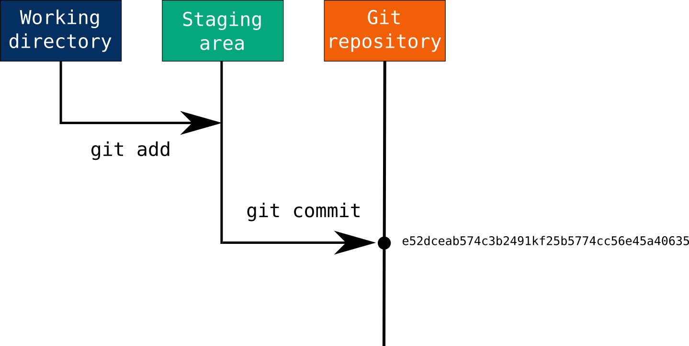

## Building Git: Part V



Hola amigos!

In previous part we updated our code to store the executable files by storing
the correct file mode. And the **major** update in the code we did was storing
the proper directory structure, i.e. storing all the sub-directories inside the root
directory by firstly storing all the blob files and then creating the merkle tree.

Now, in this part we are going to update our `commit` command, the main thing I would say.
Currently, our code is adding all the files in the directory to the commit, and we have
no control over which file we want to add or remove. So we are going to add a new command `add` to our code,
so that we can choose what file we want to add in the commit.

#### Adding `add` command

How, does `git` do this? Git maintains a file in `.git/` directory called `index`. In this file `git` stores
the file that you have added using the `git add` command. And then when you run the `git commit` command, it commits
the file from this index file.

Let's see how the git does it by the example, we have a directory that has two files.

```bash
❯ lsd
 file1.txt   file2.txt
```

Let's first see what do we have in the index file. Ohhh, we do not have the index file. Okay let's add a file
using the `add` command, and now print the content of the index file.

```bash
❯ cat .git/index
DIRCg4T2o�g4T2o@!����CK)wZ��	file1.txt�'q��p�=%
```

We are all too familiar with this type of output by now, so let's get its hexdump.

```bash
❯ hexdump -C .git/index
00000000  44 49 52 43 00 00 00 02  00 00 00 01 67 fa 34 54  |DIRC........g.4T|
00000010  32 6f c6 f6 67 fa 34 54  32 6f c6 f6 00 01 03 08  |2o..g.4T2o......|
00000020  00 40 21 16 00 00 81 a4  00 00 03 e8 00 00 03 e8  |.@!.............|
00000030  00 00 00 00 e6 9d e2 9b  b2 d1 d6 43 4b 8b 29 ae  |...........CK.).|
00000040  77 5a d8 c2 e4 8c 53 91  00 09 66 69 6c 65 31 2e  |wZ....S...file1.|
00000050  74 78 74 00 d3 cf a5 27  1a 71 e0 52 fe c9 15 f9  |txt....'.q.R....|
00000060  a9 9c 70 1e f1 af c3 3d                           |..p....=|
00000068
```

Firstly we are greated with the **12 byte** header in the file. The first 4 byte tells us the string named `DIRC`.
The `DIRC` `(44 49 52 43)` in the starting of the file, just tells the git or anyone inspecting the file that
this is the **Directory Cache** (gits terminology). That tells that these files are in the
staging area, or you can say ready to be committed.

The string is followed by 4-byte number (00 00 00 02), `2` which tells us the version of the git index format, followed by another 4-byte number (00 00 00 01). `1` which tells us 
the number entries in the `.git/index` file or in the staging area, we only have 1 file in the staging area so this also checks out.

Now that we are done with the headers, then comes the time for the data of the entries.
The index entry consists of:

1. 64-bit Ctime
   This tells the Change time of the file.
   `67 fa 34 54` tells the ctime in Sec, and `32 6f c6 f6` in Nano sec.
2. 64-bit Mtime
   This tells the Modification time of the file.
   `67 fa 34 54` tells the mtime in Sec, and `32 6f c6 f6` in Nano sec.
3. 32-bit Device info
   `00 01 003 08` tells us the information of the device from the file was added.
4. 32-bit Inode number
   `00 40 21 16` tells us the information of the file inode.
5. 32-bit File mode
   `00 00 881 a4` translated to (100644) tells us the file mode.
6. 32-bit Uid
   `00 00 03 e8` tells the user id, 1000 in decimal
7. 32-bit Gid
   `00 00 03 e8` tells the group id, 1000 in decimal
8. 32-bit File size
   `00 00 00 00` tells the size of file data, as we do not have any data so it is zero
9. 160-bit SHA-1 object ID
   `e6 9d e2 9b  b2 d1 d6 43  4b 8b 29 ae  77 5a d8 c2  e4 8c 53 91`, we are too familiar with this.
10. 8-bit Flags
    `00 09` tells us the file path name size, here it tells us the file path is 9 byte long
11. File Path
    `66 69 6c 65 31 2e 74 78 74`, 9-byte file name, translated to **file1.txt**
12. Null byte terminator and padding
    After the file path we have a null terminator that ends the detail of all the entries. All the data above us and the null terminator should be
    the multiple of 8, if it is not then we add more null terminator as padding to make it the multiple of 8.
13. 160-bit SHA-1 hash
    The remaining 20-bytes acts as a checksum, calcualted using all the above content of the
    index file

You can read more about this [here](https://mincong.io/2018/04/28/git-index/)

One more thing, can you check if you have anything in the `objects` directory. I'm waiting.

...

Hmmm, we have a blob object there don't we? That matches the object id that we saw in the index file.
Well yes, git stores it in the `objects` directory when we add them to the staging area. Maybe to make the commiting fast(I don't know I just want to copy it.)

Now that we know what we want in our index file, let's start working on the extension. Firstly we are
only going to update our code so that we can add one file at a time in our commit.

`cmd/gitgo/main.go`

```go
func main() {
    // ....
    switch os.Args[1] {
    // ....

    case "add":
        err := cmdAddHandler(os.Args[1])
        if err != nil {
            fmt.Fprintf(os.Stderr, "Error: %s\n", err)
            os.Exit(1)
        }
    }

    // ...
}
```

`cmd/gitgo/cmdHandler.go`

```go
func cmdAddHandler(args string) error {
    path := args
    data, err := os.ReadFile(path)
    if err != nil {
        return err
    }
    stat, err := os.Stat(path)
    if err != nil {
        return err
    }

    blob := gitgo.Blob{Data: data}.Init()
    hash, err := blob.Store()
    if err != nil {
        return err
    }

    index := gitgo.NewIndex()
    index.Add(path, hash, stat)
    res, err := index.WriteUpdate()
    if err != nil {
        return err
    }
}
```

Now with this we have the command, but it does not works yet. I have created a new file named `entries.go`
in the gitgo package and moved the `Entries struct` any func related to it in this file.

`entries.go`

```go
package gitgo

import (
    "os"
    "syscall"
)

const (
    maxPathSize = 0xfff
    regularMode = 0100644
    executableMode = 0100755
)

type IndexEntry struct {
    Path string
    Oid string
    Mtime int64
    MtimeNsec int64
    Ctime int64
    CtimeNsec int64
    Dev uint64
    Ino uint64
    Mode int
    Uid uint32
    Gid uint32
    Size int64
    Flags uint32
}

func NewIndexEntry(name, oid string, stat os.FileInfo) *IndexEntry {
    s := stat.Sys().(*syscall.Stat_t)
    flags := min(len(name), maxPathSize)
    var m int
    if stat.Mode()&0111 != 0 {
        m = executbleMode
    } else {
        m = regularMode
    }

    return &IndexEntry{
        Path: name,
        Oid: oid,
        Mtime: s.Mtim.Sec,
        MtimeNsec: s.Mtim.Nsec,
        Ctime: s.Ctim.Sec,
        CtimeNsec: s.Ctime.Nsec,
        Dev: s.Dev,
        Ino: s.Ino,
        Mode: m,
        Uid: s.Uid,
        Gid: s.Gid,
        Size: s.Size,
        Flags: uint32(flags),
    }
}
```

We have gotten all the metadata for the file and added them to the struct `IndexEntry`

`index.go`

```go
package gitgo

import (
    "bytes"
    "crypto/sha1"
    "encoding/binary"
    "encoding/hex"
    "fmt"
    "os"
    "path/filepath"
)

type Index struct {
    // for storing multiple file data, for future progress
    // i guess?
    entries map[string]IndexEntry
    // for evading the race condition like we did with the
    // head file writing
    lockfile *lockFile
}

// Initializing the Index struct with the lockfile for the
// `.gitgo/index` file.
func NewIndex() *Index {
    return &Index{
        entries: make(map[string]IndexEntry),
        lockfile: lockInitialze(filepath.Join(GITPATH, "index"))
    }
}

// Adding the file to the index
func (i *Index) Add(path, oid string, stat os.FileInfo) {
    entry := NewIndexEntry(path, oid, stat)
    i.entries[path] = *entry
}

func (i *Index) WriteUpdate() (bool, error) {
    // getting the lock on the index file
    b, err := i.lockfile.holdForUpdate()
    if err != nil {
        return false, err
    }
    if !b {
        return false, nil
    }

    // make a new buffer and return its pointer
    buf := new(bytes.Buffer)
    writeHeader(buf, len(i.entries))
    for _, entry := range i.entries {
        b, err := writeIndexEntry(entry)
        if err != nil {
            return true, err
        }
        buf.Write(b)
    }

    // getting the hash of the whole content in the
    // index file
    content := buf.Bytes()
    bufHash := sha1.Sum(content)
    buf.write(bufHash[:])

    i.lockfile.write(buf.Bytes())
    i.lockfile.commit()
    return true, nil
}

func writeHeader(buf *bytes.Buffer, entryLen int) error {
    _, err := buf.Write([]byte("DIRC"))
    if err != nil {
        return fmt.Errorf("writing index header: %s", err)
    }

    b := new(bytes.Buffer)
    versionNum := unit32(2)
    entriesNum := unit32(entryLen)
    binary.Write(b, binary.BigEndian, versionNum)
    binary.Write(b, binary.BigEndian, entriesNum)

    _, err = buf.Write(b.Bytes())
    if err != nil {
        return fmt.Errorf("writing index header: %s", err)
    }
    return nil
}

func writeIndexEntry(entry IndexEntry) ([]byte, error) {
	b := new(bytes.Buffer)
	err := binary.Write(b, binary.BigEndian, uint32(entry.Ctime))
	if err != nil {
		return nil, fmt.Errorf("writing ctime: %s", err)
	}
	err = binary.Write(b, binary.BigEndian, uint32(entry.CtimeNsec))
	if err != nil {
		return nil, fmt.Errorf("writing ctime nsec: %s", err)
	}
	err = binary.Write(b, binary.BigEndian, uint32(entry.Mtime))
	if err != nil {
		return nil, fmt.Errorf("writing mtime: %s", err)
	}
	err = binary.Write(b, binary.BigEndian, uint32(entry.MtimeNsec))
	if err != nil {
		return nil, fmt.Errorf("writing mtime nsec: %s", err)
	}
	err = binary.Write(b, binary.BigEndian, uint32(entry.Dev))
	if err != nil {
		return nil, fmt.Errorf("writing dev: %s", err)
	}
	err = binary.Write(b, binary.BigEndian, uint32(entry.Ino))
	if err != nil {
		return nil, fmt.Errorf("writing ino: %s", err)
	}
	err = binary.Write(b, binary.BigEndian, uint32(entry.Mode))
	if err != nil {
		return nil, fmt.Errorf("writing mode: %s", err)
	}
	err = binary.Write(b, binary.BigEndian, uint32(entry.Uid))
	if err != nil {
		return nil, fmt.Errorf("writing uid: %s", err)
	}
	err = binary.Write(b, binary.BigEndian, uint32(entry.Gid))
	if err != nil {
		return nil, fmt.Errorf("writing gid: %s", err)
	}
	err = binary.Write(b, binary.BigEndian, uint32(entry.Size))
	if err != nil {
		return nil, fmt.Errorf("writing size: %s", err)
	}
	oid, err := hex.DecodeString(entry.Oid)
	if err != nil {
		return nil, fmt.Errorf("decoding string oid: %s", err)
	}
	err = binary.Write(b, binary.BigEndian, oid)
	if err != nil {
		return nil, fmt.Errorf("writing oid: %s", err)
	}
	err = binary.Write(b, binary.BigEndian, uint16(entry.Flags))
	if err != nil {
		return nil, fmt.Errorf("writing flag: %s", err)
	}
	_, err = b.Write([]byte(entry.Path))
	if err != nil {
		return nil, fmt.Errorf("writing entry path: %s", err)
	}
	err = b.WriteByte(0)
	if err != nil {
		return nil, fmt.Errorf("writing null byte after entry: %s", err)
	}
	missing := (8 - (b.Len() % 8)) % 8
	for range missing {
		b.WriteByte(0)
	}
	return b.Bytes(), nil
}
```

Yup, the function `writeIndexEntry` is 80% error checking and returning the proper error. Well you gotta choose your poison
man, either you can use try-except or this... I like this, what about you?

Well you might get the gist, we are creating the struct for the index data,
we are making use of the `lockFile` for preventing the race condition as we
did with the writing of the `HEAD` file.

Firstly, we obtain the lock, create a buffer, write headers to the buffer and
then iterate over the map of entries. And write all of there metadata to the buffer,
after writing all the content we get the SHA-1 hash for all the content in our buffer.
And lastly we commit the data to the `index` file via lockfile commit function, that
writes all the data to the file and remove the lock to the file.

Now why don't we test our code. Let's add the new file `hello.txt` with no data. Add the file to the `git` and `gitgo`.

```bash
git add hello.txt; gitgo add hello.txt
```

Now compare the hexdump of the `.git/index` & `.gitgo/index`.

```bash
❯ hexdump -C .git/index; hexdump -C .gitgo/index
00000000  44 49 52 43 00 00 00 02  00 00 00 01 67 f2 5f 12  |DIRC........g._.|
00000010  1e 96 2a 83 67 f2 5f 12  1e 96 2a 83 00 01 03 08  |..*.g._...*.....|
00000020  00 34 1a 1d 00 00 81 a4  00 00 03 e8 00 00 03 e8  |.4..............|
00000030  00 00 00 00 e6 9d e2 9b  b2 d1 d6 43 4b 8b 29 ae  |...........CK.).|
00000040  77 5a d8 c2 e4 8c 53 91  00 09 68 65 6c 6c 6f 2e  |wZ....S...hello.|
00000050  74 78 74 00 01 e7 73 59  af ad 1b a7 93 c4 f2 66  |txt...sY.......f|
00000060  2b 50 30 1b e9 53 c6 de                           |+P0..S..|
00000068

00000000  44 49 52 43 00 00 00 02  00 00 00 01 67 f2 5f 12  |DIRC........g._.|
00000010  1e 96 2a 83 67 f2 5f 12  1e 96 2a 83 00 01 03 08  |..*.g._...*.....|
00000020  00 34 1a 1d 00 00 81 a4  00 00 03 e8 00 00 03 e8  |.4..............|
00000030  00 00 00 00 e6 9d e2 9b  b2 d1 d6 43 4b 8b 29 ae  |...........CK.).|
00000040  77 5a d8 c2 e4 8c 53 91  00 09 68 65 6c 6c 6f 2e  |wZ....S...hello.|
00000050  74 78 74 00 01 e7 73 59  af ad 1b a7 93 c4 f2 66  |txt...sY.......f|
00000060  2b 50 30 1b e9 53 c6 de                           |+P0..S..|
00000068
```

#### Adding multiple files in `index`

For now let's update our `add` handlers functionality, to add multiple
files given to it as the `args` list, then later we can make it to update the index
file in the increaments as the user wants.

For this we want to store the file provided to us in the sorted order. In our
current implementation we are getting only a single file as the input to our
`add` handler, but now we want to extend this capability and be able to add multiple files.
And the important thing is this, `git` stores these files in the sorted order. So we want a way
to add mutiple files and sort them at the same time.
For this purpose we can make use of the _Sorted Set_ data structure. As we are building this
in _Go_ we do not have built-in _Sorted Set_, so we will have to create it our self. I have
implemented the _Sorted Set_ in [this](https://vikuuu.github.io/2025-04-21-implementing-sorted-set-in-go/)
blog so I won't be mentioning about it here.

Let's update our structure.

`index.go`

```diff

  type Index struct {
  	entries  map[string]IndexEntry
+	keys     *datastr.SortedSet
  	lockfile *lockFile
  }

  func NewIndex() *Index {
  	return &Index{
  		entries:  make(map[string]IndexEntry),
+       keys:     datastr.NewSortedSet(),
  		lockfile: lockInitialize(filepath.Join(GITPATH, "index")),
  	}
  }

  func (i *Index) Add(path, oid string, stat os.FileInfo) {
  	entry := NewIndexEntry(path, oid, stat)
 +	i.keys.Add(path)
  	i.entries[path] = *entry
  }

  func (i *Index) WriteUpdate() (bool, error) {
  	b, err := i.lockfile.holdForUpdate()
  	if err != nil {
  		return false, err
  	}
  	if !b {
  		return false, nil
  	}

  	buf := new(bytes.Buffer) // makes a new buffer and returns its pointer
  	writeHeader(buf, len(i.entries))
 +	it := i.keys.Iterator()
 +	for it.Next() {
 +		path := it.Key()
 +		entry := i.entries[path]
 +		data, err := writeIndexEntry(entry)
 +		if err != nil {
 +			return true, err
 +		}
 +		buf.Write(data)
  	}

  	// getting the hash of the whole content in the
  	// index file
  	content := buf.Bytes()
  	bufHash := sha1.Sum(content)
  	buf.Write(bufHash[:])

  	i.lockfile.write(buf.Bytes())
  	i.lockfile.commit()
  	return true, nil
  }
```

We only update a little bit of code in our `index.go` to accomodate the new criteria. We will add
the files that are given to us and then add them to the sorted set, it will be added in the
sorted order (our implementation will take care of it). And then we loop over the set
and write the data to the index file.

Now we will have to update our `add` handler accordingly, to store multiple files if provided to it.

`cmd/gitgo/cmdHandler.go`

```go
func cmdAddHandler(args []string) error {
	index := gitgo.NewIndex()
	for _, path := range args {
		data, err := os.ReadFile(path)
		if err != nil {
			return err
		}
		stat, err := os.Stat(path)
		if err != nil {
			return err
		}

		blob := gitgo.Blob{Data: data}.Init()
		hash, err := blob.Store()
		if err != nil {
			return err
		}

		index.Add(path, hash, stat)
	}
	res, err := index.WriteUpdate()
	if err != nil {
		return err
	}

	if res {
		fmt.Println("Written data to Index file")
	}

	return nil
}
```

Now with this we are done, with the first extension of the `add` handler to store multiple
file paths if provided.

#### Storing the given folder

Now we want to update our code, so that if the user only gives us the folder, then we take
that folder and expand it to contain all the files that are present inside the index file.
So that if the user gives us the input like `gitgo add .`, we can take this and add all the files,
that are inside the root directory that has the `.gitgo` folder.

For this we will have to update our `ListFiles` function in the `files.go` file.

`files.go`

```diff 
func ListFiles(dir string) ([]string, error) {
    var workfiles []string

    err := filepath.WalkDir(dir, func(path string, d fs.DirEntry, err error) error {
        if err != nil {
            return err
        }

        // check if the given dir path is file or directory?
+       s, err := os.Stat(path)
+       if !s.IsDir() {
+           relPath, err := filepath.Rel(dir, path)
+           if err != nil {
+               return err
+           }
+           if relPath == "." {
+               relPath, err = filepath.Rel(ROOTPATH, path)
+               if err != nil {
+                   return err
+               }
+               workfiles = append(workfiles, relPath)
+               return nil
+           }
+       }
        name := filepath.Base(path)
        // skip the files or directories found in the ignore hashmap
        if _, found := g_ignore[name]; found {
            if d.IsDir() {
                return filepath.SkipDir
            }
            return nil
        }

        // Append only files, not directories
        if !d.IsDir() {
+           relPath, err := filepath.Rel(ROOTPATH, path)
+           if err != nil {
+               return err
+           }
            workfiles = append(workfiles, relPath)
        }
        return nil
    })
    if err != nil {
        return nil, err
    }
    return workfiles, nil
}
```

Now let's update the `cmdHandler` to reflect the changes we made in our `add` functionality.

`cmd/gitgo/cmdHandler.go`

```diff
func cmdAddHandler(args []string) error {
    index := gitgo.NewIndex()
    for _, path := range args {
+       absPath, err := filepath.Abs(path)
+       if err != nil {
+           return err
+       }
+
+       expandPaths, err := gitgo.ListFiles(absPath)
+       if err != nil {
+           return err
+       }
+
+       for _, p := range expandPaths {
+           ap, err := filepath.Abs(p)
+           if err != nil {
+               return err
+           }

+           data, err := os.ReadFile(ap)
            if err != nil {
                return err
            }
+           stat, err := os.Stat(ap)
            if err != nil {
                return err
            }

            blob := gitgo.Blob{Data: data}.Init()
            hash, err := blob.Store()
            if err != nil {
                return err
            }

+           index.Add(p, hash, stat)
        }
    }
    res, err := index.WriteUpdate()
    if err != nil {
        return err
    }

    if res {
        fmt.Println("Written data to Index file")
    }
    return nil
}
```

And now we are done with our basic implementation of the `add` handler. Now we can
add multiple files given to us as arguments or a folder given to us as an arguments.

## Afterwords

- We have added the `add` command, that puts the selected files in the staging area(aka, git's index file).
- We are able to add multiple files given as an arguments.
- We are able to add all the files inside the give folder path as an arguments.

In then next part we will be working on udpating the `add` command, so that
it can add files to the staging area, in an incremental way.

Code Link: [Github](https://github.com/Vikuuu/gitgo)

Just know this,

> Reinvent the wheel, so that you can learn how to invent wheel
>
> – a nobody
