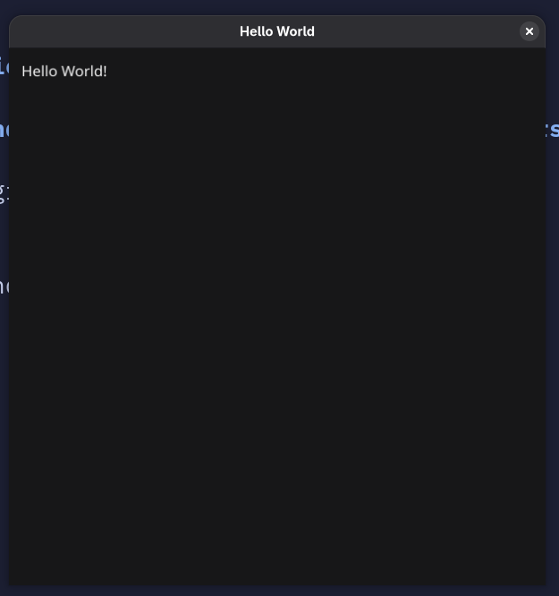

So while surfing and wasting time on the YouTube platform, I came across this 
[video](https://youtu.be/sItRLFjbqvo?si=5dTcGwMJ6Pg4AM_K) by Daniel Hirsch's channel. He built 
the *image viewer* in pure **C**(the language of God's or something like that), using SDL/SDL2 GUI library.
For the image format of PPM.

After seeing the whole video, I thought that wasn't to hard now was it? Why not make one myself in **Go**.
Just for fun. This is will also teach me about the image file's that I was wondering about for sometime.
So here is the blog of me just doing that.

# GUI part

For the GUI part of the image viewer project, We will be using the [Fyne](https://fyne.io/) library that
helps in making the native applications in pure **Go**. Let's first just write the code that will just
open a window of 500 X 500 with the text *Hello World* written on it.


```go
//main.go
package main

import (
    "fyne.io/fyne/v2"
    "fyne.io/fyne/v2/app"
    "fyne.io/fyne/v2/widget"
)

func main() {
    a := app.New()
    w := a.NewWindow("Hello World")

    w.SetContent(widget.NewLabel("Hello World!"))
    w.Resize(fyne.NewSize(float32(500), float32(500)))
    w.ShowAndRun()
}
```

Run this code, and you output should be something like this.
If your code is taking some time in compiling, that is fine because fyne takes the time compiling first time
and the next subsequent compiles will be faster because of caching.

# Parsing the Image file

Now onto the main meat of the image viewer. What image viewer does (based on my understanding) is that
it reads the image file data, and then print the each pixel onto the GUI. So the image viewer reads the
image file, checks the image format type, check the width and height of the image provided in the image,
and then reads the pixel data of the row and column.

In this blog article we will be tackling with the PPM image file type, which is the easiest to parse I would say.
You can read the of the file [here](https://netpbm.sourceforge.net/doc/ppm.html).

In easy words, I will sum it up here:

- The first line will be the filetype, either P3 or P6 followed by linefeed('\n' char or 10 on ASCII chart).
- There can be any amount of comment lines starting with '#' character, ending with linefeed(we have to ignore them).
- The Second line will be the two number separated by space telling the width and height of the image in pixels.
- The Third line will be the number representing the max value of the color(max value will be 255).
- The Fourth line and after that will be the pixel data in RGB format, first number will tell the Red color data,
next one Green and last one will tell about Blue color.

The P3 tell us that the pixel data will be in ASCII form, and P6 will tell that pixel data will be in Binary form.

Let's see the example of the PPM P3 image type.

```txt

            p3image.ppm                     Decoding  the image
 +---------------------------------+
 | P3                              |    <- Image type 
 | # This is a comment             |    <- Comment (ignore this)
 | 4 4                             |    <- Width and Height of image
 | 255                             |    <- Max pixel color value 
 | 0 0 255 0 0 255 0 0 255 0 0 255 |    <- R G B value of a row and column
 | 255 0 0 255 0 0 255 0 0 255 0 0 |    
 | 0 0 255 0 0 255 0 0 255 0 0 255 |    
 | 255 0 0 255 0 0 255 0 0 255 0 0 |    
 +---------------------------------+
```

Let's make basic structure, Our code will take one parameter that will be PPM image file name.

```go
//main.go
package main

func main() {
    filePath := os.Args[1]
    parseImage(filePath)
}
```
–
```go
//image_parser.go
package main

import (
    "fmt"
    "os"
    "path/filepath"

    "fyne.io/fyne/v2/app"

    "github.com/Vikuuu/go-image-viewer/imageutil/bmp"
    "github.com/Vikuuu/go-image-viewer/imageutil/ppm"
)

func parseImage(fp string) {
    fileName := filepath.Base(fp)
    ext := filepath.Ext(fileName)

    myApp := app.New()
    win := myApp.NewWindow(fileName)
    file, err := os.OpenFile(fp, os.O_RDONLY, 0o755)
    if err != nil {
        fmt.Fprintf(os.Stderr, "error: %v", err)
    }
    defer file.Close()
    switch ext {
    case ".ppm":
        ppm.ParsePPM(file, &win)
    default:
        fmt.Fprintln(os.Stdout, "Parser for this file not implemented")
    }
    win.ShowAndRun()
}
```

In the *parseImage* function, we will be taking the filepath. We will open the file, create the new application
in the fyne and pass the __*os.File__ and the __fyne.Window__ to the *ParsePPM* function. Here we will be checking
the extension of the file and then call to the appropriate image parser, so that we can extend it for other image
types also.

Make new package in the root directory of your project, named `imageutil/ppm`, and create the file named `parser.go`

```go
//imageutil/ppm/parser.go
package ppm

import (
    "bufio"
    "fmt"
    "os"
    "strings"

    "fyne.io/fyne/v2"
    "fyne.io/fyne/v2/canvas"
)

func ParsePPM(f *os.File, win *fyne.Window) {
    // create a new reader on the file
    reader := bufio.NewReader(f)
    // read the first line containing P3 or P6
    fileType, err := reader.ReadString('\n')
    if err != nil {
        fmt.Fprintln(os.Stderr, err)
    }
    fileType = strings.TrimSpace(fileType)
    // width and height for the window
    var winW, winH int
    // iamge canvas that will show the image on the window
    imgCanvas := &canvas.Image{}
    switch line {
    case "P3":
        w, h, img := parseP3(reader)
        imgCanvas = canvas.NewImageFromImage(img)
        winW, winH = w, h
    case "P6":
        w, h, img := parseP6(reader)
        imgCanvas = canvas.NewImageFromImage(img)
        winW, winH = w, h
    default:
        fmt.Fprintln(os.Stderr, "File is not PPM image file")
    }

    (*win).SetContent(imgCanvas)
	(*win).Resize(fyne.NewSize(float32(winW), float32(winH)))
}
```

## P6 PPM image parser

First we will be creating parser for the P6 image type, because it is easier. Till now we have read the 
first line and confirmed that the metadata for the PPM P6 file type is correct. Now we will be reading the
rest of the file data.


```go
//imageutil/ppm/parser.go
package ppm

import (
    "color"
    "image"
    "io"
    "strconv"
)

func ParseP6(reader *bufio.Reader) (w, h int, img *image.RGBA) {
    // read second line
    var line string
    var err error
    for {
        line, err = reader.ReadString('\n')
        if err != nil {
            fmt.Fprintf(os.Stderr, "error reading the Dimensions line of PPM p6 file: %v\n", err)
        }
        // if the line is not comment break the loop
        if line[0] != '#' {
            break
        }
    }

    // width and height data is like this (250 250\n)
    // convert it into the slice
    dimensions := strings.Split(line, " ")
    // convert the string type into int type
    tempW, err := strconv.Atoi(strings.TrimSpace(dimensions[0]))
    if err != nil {
        fmt.Fprintf(os.Stderr, "%v\n", err)
    }
    // convert the string type into int type
    tempH, err := strconv.Atoi(strings.TrimSpace(dimensions[1]))
    if err != nil {
        fmt.Fprintf(os.Stderr, "%v\n", err)
    }

    // read third line that contains the max pixel value(e.g - 255)
    var maxPixelValStr string
    for {
        maxPixelValStr, err = reader.ReadString('\n')
        if err != nil {
            fmt.Fprintf(os.Stderr, "%v\n", err)
        }
        if maxPixelValStr[0] != '#' {
            break
        }
    }
    maxPixelValStr = strings.TrimSpace(maxPixelValStr)
    maxPixelVal, err := strconv.Atoi(maxPixelValStr)

    factor := uint8(255 / maxPixelVal)

    w = int(tempW)
    h = int(tempH)
    // Here we are creating an image type, with the width and height
    // of the image with the parsed w and h. Setting its starting point
    // to x=0, y=0
    img = image.NewRGBA(image.Rect(0, 0, w, h))
    for i := range h {
        for y := range w {
            // make a slice a byte of size 3, storing the RGB
            // value of the pixel
            colors := make([]byte, 0, 3)
            for len(colors) < 3 {
                // Read the byte from the reader that has the 
                // pixel data, and append that data to the 
                // colors slice
                c, err := reader.ReadByte()
                if err != nil {
                    if errors.Is(err, io.EOF) {
                        break
                    }
                    fmt.Fprintf(os.Stderr, "error: %v\n", err)
                }
                colors = append(colors, c)
            }
            // Set the value of x, y with the pixel value
            // that we parsed
            img.SetRGBA(y, i, color.RGBA{
                R: colors[0] * factor,
                G: colors[1] * factor,
                B: colors[2] * factor,
                A: 255,
            })
        }
    }

    // return the width, height of the image
    // and the image type that we built
    return w, h, img
}
```
This is a big function, but what it does is simple.

- Ignores the comments.
- It reads the dimension of the image(width and height).
- Reads the maximum pixel value used. We need to scale the pixel data value.
- Runs the loop and read the pixel value and builds the image from it.

We need the factor value and multiply it with the pixel color value. Suppose the max color value is 15.
We need to scale that value to the 255. So the factor will be 17.

You can download a sample PPM P6 image from [here](https://github.com/Vikuuu/go-image-viewer/blob/main/testdata/p6image.ppm).
Run your code and pass the image path to it, and you should see the window open and see the image that you saw
on the landing of the blog.

## P3 PPM image parser

Now for the P3 PPM image. We need a little improvisation, because the pixel data
is in the ASCII form not the binary form. And there can be multiple whitespaces between the pixel data.
So for this we are going to create our own scanner, that will scan the pixel data and give us the integer
value. I think we can do this by using the bufio scanner, but I am going to built it anyways for learning
purpose. Here is the code just doing that.

```go
//imageutil/scanner.go
package imageutil

import (
    "strconv"
    "unicode"
)

type Scanner struct {
    input        []byte
    position     int  // current position in input
    readPosition int  // current reading position
    ch           byte // current character
}

func NewScanner(input []byte) *Scanner {
    s := &Scanner{input: input}
    s.readChar() // Initialize first Character
    return s
}

// Read the next character
func (s *Scanner) readChar() {
    if s.readPosition >= len(s.input) {
        s.ch = 0
    } else {
        s.ch = s.input[s.readPosition]
    }
    s.position = s.readPosition
    s.readPosition++
}

// Skip all the whitespace character
func (s *Scanner) skipWhitespace() {
    for s.ch == ' ' || s.ch == '\n' || s.ch == '\r' || s.ch == '\t' {
        s.readChar()
    }
}

// Gives the next number in the scanner
func (s *Scanner) NextNumber() uint8 {
    s.skipWhitespace()
    b := s.readNumber()
    num, err := strconv.Atoi(string(b))
    if err != nil {
        panic("error: " + err.Error())
    }
    return uint8(num)
}

func (s *Scanner) readNumber() []byte {
    position := s.position
    for isDigit(s.ch) {
        s.readChar()
    }
    return s.input[position:s.position]
}

func isDigit(b byte) bool {
    return unicode.IsDigit(rune(b))
}
```

This code expert is mainly from my blog post of writing a lexer, you can read it 
[here](https://vikuuu.github.io/posts/writing-go-lexer-in-go/) if you want.
Now we will be using this in our P3 parser. The logic and code will be the same, but we will using 
after our scanner when we will move to reading the pixel data.

```go
//imageutil/ppm/parser.go
func ParseP3(reader *bufio.Reader) (w, h int, img *image.RGBA) {
    var line string
    var err error
    // read second line
    for {
        line, err = reader.ReadString('\n')
        if err != nil {
            fmt.Fprintf(os.Stderr, "error reading the Dimensions line of PPM p3 file: %v\n", err)
        }
        if line[0] != '#' {
            break
        }
    }

    dimensions := strings.Split(line, " ")
    tempW, err := strconv.Atoi(strings.TrimSpace(dimensions[0]))
    if err != nil {
        fmt.Fprintf(os.Stderr, "%v\n", err)
    }
    tempH, err := strconv.Atoi(strings.TrimSpace(dimensions[1]))
    if err != nil {
        fmt.Fprintf(os.Stderr, "%v\n", err)
    }

    // read third line (255)
    var maxPixelValStr string
    for {
        maxPixelValStr, err = reader.ReadString('\n')
        if err != nil {
            fmt.Fprintf(os.Stderr, "%v\n", err)
        }
        if maxPixelValStr[0] != '#' {
            break
        }
    }
    maxPixelValStr = strings.TrimSpace(maxPixelValStr)
    maxPixelVal, err := strconv.Atoi(maxPixelValStr)

    factor := uint8(255 / maxPixelVal)

    w = int(tempW)
    h = int(tempH)
    img = image.NewRGBA(image.Rect(0, 0, w, h))

    // Read all the data left in the reader
    input, err := io.ReadAll(reader)
    if err != nil {
        fmt.Fprintf(os.Stderr, "error: %v\n", err)
    }

    // Create the new scanner for the data read from the reader
    colorScanner := imageutil.NewScanner(input)
    for i := range h {
        for j := range w {
            colors := make([]uint8, 0, 3)
            for len(colors) < 3 {
                c := colorScanner.NextNumber()
                colors = append(colors, c)
            }
            img.SetRGBA(j, i, color.RGBA{
                R: colors[0] * factor,
                G: colors[1] * factor,
                B: colors[2] * factor,
                A: 255,
            })
        }
    }

    return w, h, img
}
```

Creating the scanner helped minimizing the code in the main parsing function and keep it same as
the parsing P6.

And voila. We have our own image viewer in Go. Yippee.

# Afterword

In this blog post,

- We created an image viewer application for PPM image file type.
- It helped us in understanding the image file types a little better.

GitHub Code Link - [here](https://github.com/Vikuuu/go-image-viewer)

I have also built the parser for the Bitmap image file, maybe next part will be on that.
Stay Tuned.

Just know this,

> Reinvent the wheel, so that you can learn how to invent wheel
>
> – a nobody
