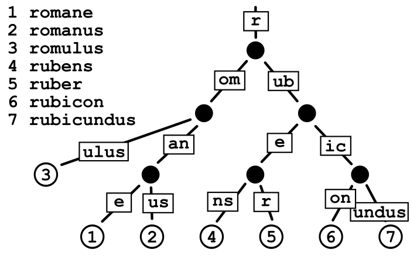

While reading the book *Let's GO Further*, We are using the HTTP routing using the `httprouter` package 
to make our API's. The one of the benefit the author tell about this package is that it uses the **Radix 
Trie** for url path matching.

So, me being me, thought what is **Radix Trie** why not just build it? And woilaaa, here we are in the article
and we are just going to do exactly that.

## Implementing Trie Data Structure

Before, implementing the main talking point of our article, let's get the basics and build the parent of the **Radix Trie**
that is **Trie**(didn't expect him to be here?).

The idea is simple with the *Trie*, its like a *Binary Tree* but it has many childrens, usually **26** (cause english has these
many letters). And each node hold Two things 1) a letter, 2) is it a word?

This is best for data-structure that we may need on a string. Like autocomplitions?

The benefit that a *Trie* has over the *Binary Tree* is that it does not require any balancing algorithm.

Let's create some test's first defining what we want.

*trie_test.go*

```go
package whatever

import (
    "testing"

    "github.com/stretchr/testify/assert"
)

func TestTrie(t *testing.T) {
    tr := NewTrie()

    for _, w := range []string{"go", "gopher", "Game", "goal"} {
        err := tr.Insert(w)
        assert.NoError(t, err)
    }

	for _, want := range []string{"go", "gopher", "game", "goal"} {
		err := tr.Search(want)
		assert.NoError(t, err)
	}

	err := tr.Search("ghost")
	assert.ErrorIs(t, err, ds.ErrNoSuchWord)

	err = tr.Search("g")
	assert.ErrorIs(t, err, ds.ErrNoSuchWord)

	// Deletion & Search
	err = tr.Delete("go")
	assert.NoError(t, err)

	err = tr.Search("go")
	assert.ErrorIs(t, err, ds.ErrNoSuchWord)

	err = tr.Delete("gopher")
	assert.NoError(t, err)

	err = tr.Search("gopher")
	assert.ErrorIs(t, err, ds.ErrNoSuchWord)

	err = tr.Search("game")
	assert.NoError(t, err)
	err = tr.Search("Goal")
	assert.NoError(t, err)

	err = tr.Delete("carbon")
	assert.ErrorIs(t, err, ds.ErrNoSuchWord)
}
```

We will create the structure's that will hold the values. So we want a node thingy that will hold 
1) value, 
2) children pointers, 
3) parent for tranversing up, and 
4) is flag that will tell if it is a word or nah.

Then the main trie, that will have a root, with no value in it.

We will also define the error types, its optional, if you want you can choose not return errors.

*trie.go*

```go
package whatever

import (
    "error"
)

// defining all the error types that we would want to return
var (
	ErrNoSuchWord  = errors.New("no such word in trie")
	ErrNotWord     = errors.New("not word")
	ErrEmptyWord   = errors.New("empty word")
	ErrInvalidRune = errors.New("invalid character")
)


type trieNode struct {
    value    rune
    children [26]*trieNode
    parent   *trieNode
    isWord   bool
}

func NewTrieNode(val rune) *trieNode {
    return &trieNode{value: val}
}

type Trie struct {
    head *trieNode
}

func NewTrie() *Trie {
    var r rune
    return &Trie{head: NewTrieNode(r)}
}

// a helper function to get the index value
// will be helpful
func getIndex(r rune) (int, error) {
	if r < 'a' || r > 'z' {
		return -1, ErrInvalidRune
	}
	return int(r - 'a'), nil
}
```

The first method we would want to build is `Search`.
The algo will go like this
1) Traverse the given word,

2) Check if the character is present in the trie, if it is then we move onto that, and

3) If the character is not present, then the word is not in the trie and return error.

Lastly, if every thing goes well we will be at the word's last character node. Now if it is not a word return error else nothing.

```diff
import (
    "error"
+   "strings"
)
```


```go
func (t *Trie) Search(word string) error {
    if word == "" {
        return ErrEmptyWord
    }
    
    cur := t.head
    for _, r := range strings.ToLower(word) {
        idx, err := getIndex(r)
        if err != nil {
            return err
        }

        child := cur.children[idx]
        if child == nil {
            return ErrNoSuchWord
            }
        }
        cur = child
    }

    if cur.isWord {
        return nil
    }
    return ErrNoSuchWord
}
```

Now, let's get to the `Insert` method. It's simple, we want
1) To traverse the word,
2) If the character is present in the *trie* cool, we move to the next character,
3) If not then we create a new trie node, and move on

Lastly, we will set the word flag to be true.

```go
func (t *Trie) Insert(word string) error {
    if word == "" {
        return ErrEmptyWord
    }
    cur := t.head

    for _, r := range strings.ToLower(word) {
        idx, err := getIndex(r)
        if err != nil {
            return err
        }

        child := cur.children[idx]
        if child == nil {
            child = NewTrieNode(r)
            child.parent = cur
            cur.children[idx] = chil
        }
        cur = child
    }
    cur.isWord = true
    return nil
}
```

The last method `Delete`, things we want to 
1) traverse to the bottom of the trie, if we cannot that means the word is not in the
trie, return err
2) check if the last node is a word, if not return error it is not a word, if 
it is true then mark it false
3) now, traverse up remove the node.

```go
func (t *Trie) Delete(word string) error {
	if word == "" {
		return ErrNotWord
	}

	cur := t.head
	for _, r := range strings.ToLower(word) {
		idx, err := getIndex(r)
		if err != nil {
			return err
		}

		child := cur.children[idx]
		if child == nil {
			return ErrNoSuchWord
		}
		cur = child
	}

	if !cur.isWord {
		return ErrNotWord
	}
	cur.isWord = false

	parent := cur.parent
	for parent != nil {
		if t.hasChildren(parent) || cur.isWord {
			break
		}
		idx, err := getIndex(cur.value)
		if err != nil {
			return err
		}

		parent.children[idx] = nil
		cur = parent
		parent = parent.parent
	}
	return nil
}

func (t *Trie) hasChildren(parent *trieNode) bool {
	count := 0
	for _, pointer := range parent.children {
		if pointer != nil {
			count++
		}
	}
	if count > 1 {
		return true
	}
	return false
}
```

We done with our *Trie* implementation, now run the test, we should be passing all these tests.

## Implementing Radix Trie Data Structure

Now to the main, agenda of the day. The normal *Trie* has one problem, it is not very space efficient.
It creates node for every letter of the word.

That's where the *Radix Trie* comes in. *Radix Trie* compact the words. Let's see an example with a 
*beautiful* ascii art.

```
            RO OT
              |
            /   \
       bankai    wa
                /  \
              ste   t
                   / \
                  ch  er
```

Here we have the words *bankai*, *water*, *waste*, *watch*.
The word *bankai* is present as a whole word in the trie. The latter words a split *wa*, *ste*, *t*, *ch*, *er*.
All the last nodes are marked as words.

Let's get started with the strucuture.
1) we want an edge that will have the label and the next node,
2) the node that will have isWord flag, hashmap with key as character and the value with the edge,
3) lastly, the main trie structure.

You can create the tests, like we did above.

*radix.go*

```go
package whatever

type rdxE struct {
    label string
    next  *rdxN
}

func newRdxE(label string ) *rdxE {
    return &rdxE{label: label, next: newRdxNode(false)}
}

func newRdxEWithNext(label string, next *rdxN) *rdxE {
    return &rdxE{label: label, next: next}
}

type rdxN struct {
    edge   map[rune]*rdxE
    isWord bool
}

func newRdxNode(isWord bool) *rdxN {
    return &rdxN{edges: make(map[rune]*rdxE), isWord: isWord}
}

func (r *rdxN) addEdge(label string) {
    r.edges[rune(label[0])] = newRdxE(label)
}

func (r *rdxN) addEdgeWithNext(label string, next *rdxN) {
    r.edges[rune(label[0])] = newRdxEWithNext(label, next)
}

func (r *rdxN) getTransition(transitionChar rune) *rdxE {
	return r.edges[transitionChar]
}

type RdxTrie struct {
    root *rdxN
}

func NewRadixTrie() *RdxTrie {
    return &RdxTrie{root: newRdxNode(false)}
}
```

The `node` will have edge's map as rune -> edge, and `isWord` flag tells whether upto this word it is a word.
The `edge` will have the label, that will have the compact word if possible and the pointer to the next node.

The basic function `Insert`, `Search` & `Delete`. We separate the these because we are going to use the 
`recursion` (whoa... that scared me). It's is a best idea to make a new function which will do the recursion for us 
(that's what I've heard).

```go
func (r *RdxTrie) Search(word string) bool {
	return r.search(r.root, word)
}

func (r *RdxTrie) Insert(word string) error {
	if word == "" {
		return ErrEmptyWord
	}
	r.insert(r.root, word)
	return nil
}

func (r *RdxTrie) Delete(word string) {
	r.delete(r.root, word)
}
```

Firstly, the `Search`. The Idea
1) get edge with the first character of the searching word
2) if the edge is null, return false
3) if the edge label does match the prefix of the searching word
4) if the edge label and the word match AND it is a word, return true
5) cut the prefix, then recurse with the cutted word, and the next node.

Let's see it in action

```go
func getRuneAt(word string, idx int) rune {
	return rune(word[idx])
}

func (r *RdxTrie) search(cur *rdxN, word string) bool {
    // base case
    if word == "" {
        return cur.isWord
    }
    
    transistionChar := getRuneAt(word, 0)
    childEdge := cur.getTransition(transitionChar)

    if childEdge == nil {
        return false
    }

    if !strings.HasPrefix(word, childEdge.label) {
        return false
    }

    after, found := strings.CutPrefix(word, childEdge.label)
    if !found {
        return false
    }

    return r.search(childEdge.next, after)
}
```

Now, for the `Insert` method. There are mutlitple case.
1) The word is not present in the trie, so simply add,
2) We want to add the word, and its prefix is present(e.g. word to be added "slower", "slow" already present),
3) The opposite of the 2 (e.g. "slower" is present, want to add "slow")
4) The word to be added and the word in the tree share the prefix (e.g. adding "waste", and "water" is present)
5) The word is already present, mark it as word.

```go
func (r *RadixTrie) commonPrefix(s1, s2 string) int {
	if len(s1) < 1 || len(s2) < 1 {
		return -1
	}
	minLen := min(len(s1), len(s2))
	cmnPreLen := -1

	for i := range minLen {
		if s1[i] != s2[i] {
			break
		}
		cmnPreLen++
	}

	return cmnPreLen
}

func (r *RdxTrie) insert(curr *rdxN, word string) {
    if word == "" {
        return
    }

    transitionChar := getRuneAt(word, 0)
    childEdge := curr.getTransistion(transitionChar)

    // case 1: word not present in the trie
    if childEdge == nil {
        curr.addEdge(word)
		childEdge = curr.getTransition(transitionChar)
		childEdge.next.isWord = true

		return
    }

	// Case 5: the word is already present as a label
	if word == childEdge.label {
		childEdge.next.isWord = true
		return
	}

	cmnPreIdx := r.commonPrefix(word, childEdge.label)

	// Case 2: adding word "slower", "slow" is present
	if cmnPreIdx+1 == len(childEdge.label) {
		suffix := word[cmnPreIdx+1:]
		r.insert(childEdge.next, suffix)
		return
	}

	// Case 3: adding word "slow", "slower" is present
	if cmnPreIdx+1 == len(word) {
		prefix := word[:cmnPreIdx+1]
		suffix := childEdge.label[cmnPreIdx+1:]
		delete(curr.edges, transitionChar)
		// add the prefix word
		curr.addEdge(prefix)
		newChildEdge := curr.getTransition(transitionChar)
		newChildEdge.next.isWord = true
		// recursive call
		r.insert(newChildEdge.next, suffix)
		return
	}

	// Case 4: adding word "waste", "water" is present
	// so the common Prefix idx len will not be equal to
	// the label or the word itself
	prefix := word[:cmnPreIdx+1]
	wordSuffix := word[cmnPreIdx+1:]
	labelSuffix := childEdge.label[cmnPreIdx+1:]
	delete(curr.edges, transitionChar)
	// add the prefix word
	curr.addEdge(prefix)
	newChildEdge := curr.getTransition(transitionChar)
	// if the prefix itself is a complete word
	if len(wordSuffix) == 0 {
		newChildEdge.next.isWord = true
	}
	// reatach the old label suffix under the new prefix
	newChildEdge.next.addEdgeWithNext(labelSuffix, childEdge.next)
	// add the new word's suffix
	if len(wordSuffix) > 0 {
		newChildEdge.next.addEdge(wordSuffix)
		newChildEdge.next.getTransition(getRuneAt(wordSuffix, 0)).next.isWord = true
	}

}
```

Now, the `Delete`, we want to traverse and get to the end word, and on the way back up
want to remove uncessary nodes.

```go
func (r *RadixTrie) delete(cur *rdxN, word string) *rdxN {
	if word == "" {
		return nil
	}

	transitionChar := getRuneAt(word, 0)
	edge := cur.getTransition(transitionChar)

	if edge == nil {
		return nil
	}

	if edge.label == word {
		edge.next.isWord = false
		return cur
	}

	cmnPrefix := r.commonPrefix(word, edge.label)
	suffix := word[cmnPrefix+1:]

	del := r.delete(edge.next, suffix)
	if del != nil {
		delete(cur.edges, getRuneAt(suffix, 0))
	}

	return cur
}
```

And know, we are done with our *Radix Trie* implementation.

Do check the implementation, and let me know if there is any edge case that I might be missing.

## Afterwords

After days of smashing my head, I got the gist of implementing the *Radix Trie*.

- [Trie implementation](https://github.com/Vikuuu/go-data-structure/blob/main/trie.go)
- [Radix Trie implementation](https://github.com/Vikuuu/go-data-structure/blob/main/radix_trie.go)

Just know this,

> Reinvent the wheel, so that you can learn how to invent wheel
>
> -- a nobody

## References

- [Opengenus Radix Trie](https://iq.opengenus.org/radix-tree/)
- [Opengenus Trie](https://iq.opengenus.org/tries/)
- Google
- ChatGPT (for some edge cases, that might have missed.)
